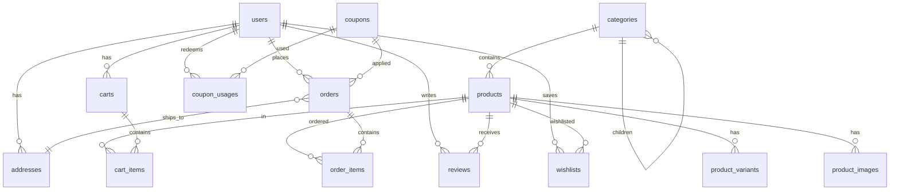

# Velcommerce — E-Commerce Portfolio (Laravel + Inertia + React)


Monolith e-commerce portfolio: katalog, keranjang persist di DB, checkout multi-step dengan payment mock (siap integrasi Midtrans/Xendit sandbox), admin dashboard analytics, review & rating, wishlist, voucher/kupon, notifikasi email via queue, SEO dinamis + sitemap + SSR, optimasi gambar.

Demo: `https://velcommerce.up.railway.app` · Lihat [Instalasi](#instalasi) untuk akun demo.

---

## ✨ Fitur

| Kategori | Fitur |
|----------|-------|
| **Katalog** | List + filter kategori/harga/search (Inertia partial reload), pagination, produk featured |
| **Produk** | Galeri, varian (sku/stock/price override), stok total, related reviews |
| **Keranjang** | Persist DB (user & guest session), merge saat login, cap stok |
| **Checkout** | 3 step: `checkout/address` → `confirm` → `store` (transaction + lockForUpdate, decrement stok atomik), kupon dari session |
| **Payment** | `PaymentGateway` contract + `MockGateway` (local/testing/staging), `POST /orders/{order}/mock-callback` |
| **Order** | History, tracking `pending → paid → shipped → completed` + cancelled/failed, cancel dengan restore stok |
| **Admin** | Dashboard (Recharts: penjualan harian, produk terlaris, stok rendah KPI), CRUD produk + multi-image upload (Intervention Image WebP 1200px), manajemen order status, kupon CRUD, moderasi review |
| **Pembeda** | Review & rating (1 per user/produk, hanya yang sudah beli), Wishlist (counter di navbar via shared props), Voucher (percent/fixed, cap, limit), Email notifikasi (OrderPlaced, StatusUpdated, Payment — queue `database`, mailer `log`) |
| **Polish** | SEO dinamis (title/desc/canonical/OG/JSON-LD Product+Breadcrumb), `sitemap.xml` + `robots.txt` (cache 1 jam), Inertia SSR (`build:ssr` → `bootstrap/ssr/ssr.js`), lazy load + `fetchPriority` + Intervention Image |

---

## 🧱 Stack

| Layer | Teknologi |
|-------|-----------|
| Backend | Laravel 13, PHP 8.5, Fortify (auth + 2FA), `spatie/laravel-permission` |
| Frontend | Inertia.js 3 + React 19 + TypeScript, Tailwind v4 + shadcn/ui, Recharts |
| Image | `intervention/image` 4.3 (GD, WebP 82%, max 1200px, `storeOptimized`) |
| DB | MySQL / PostgreSQL (prod), SQLite `:memory:` (test) |
| Testing | Pest 4, PHPStan level 7, Pint |
| Build | Vite 8 + `@inertiajs/vite` SSR |

---

## 🗂️ ERD (sederhana)



**Tabel inti:** `users`, `categories`, `products`, `product_variants`, `product_images`, `addresses`, `carts`, `cart_items`, `orders`, `order_items`, `reviews`, `wishlists`, `coupons`, `coupon_usages` + `permission` tables.

---

## 🚀 Instalasi (lokal)

```bash
git clone https://github.com/velcommerce/velcommerce.git
cd velcommerce
composer setup          # install, key:generate, migrate, npm install + build
php artisan db:seed     # RoleSeeder + AdminUserSeeder + 20 produk + kategori + cart demo
npm run dev             # Vite HMR (atau composer run dev untuk concurrent: vite + queue + pail)
php artisan serve       # http://localhost:8000
```

Untuk SSR (opsional lokal):
```bash
npm run build:ssr
php artisan inertia:start-ssr   # Node SSR di http://127.0.0.1:13714
# atau: node bootstrap/ssr/ssr.js
```

**Akun demo (password: `password`):**

| Role | Email | Catatan |
|------|-------|---------|
| Admin | `admin@velcommerce.test` | Akses `/admin` (dashboard, produk, order, kupon, review) |
| Customer | `customer@velcommerce.test` | Sudah verified, punya alamat default, bisa checkout |
| Test | `test@example.com` | User generik starter kit |

Checkout: tambah produk → `cart` → `checkout/address` (pilih alamat) → `confirm` (apply `coupons.apply` bila ada) → `Place Order` → `orders/{order}/payment` → `POST /orders/{order}/mock-callback` dengan `outcome=paid`.

---

## 🧪 Testing

```bash
php artisan test --compact           # 130+ feature + unit (Pest)
npm run types:check                  # tsc --noEmit + phpstan analyse
composer ci:check                    # lint:check + format:check + types:check + test
```

Coverage fase 4:
- `CheckoutFlowTest` — happy path, stok habis, kupon invalid, guest/unverified redirect, mock callback → paid
- `SitemapTest` — XML valid, exclude inactive, robots, seo/json-ld props di `products/show`
- `ProductImageOptimizationTest` — resize 1200, WebP, tidak upscale, upload admin via `ImageService`

CI: `.github/workflows/tests.yml` — tiap `push:main` + PR, setup PHP 8.5 (gd) + Node 22 + cache composer/npm + `npm run build:ssr` + `composer ci:check`.

---

## 🔍 SEO & SSR

- **Meta:** `app/Models/Product.php` (`getSeoTitleAttribute` 60 char, `getSeoDescriptionAttribute` 160 char fallback `meta_* → short_description → description`), `CatalogController@show` kirim `seo` + `jsonLd` (Product `offers/aggregateRating`) + `breadcrumbLd`.
- **Komponen:** `resources/js/components/seo-head.tsx` (maps `Head` → title/desc/canonical/OG/Twitter/JSON-LD script).
- **Sitemap:** `GET /sitemap.xml` (`SitemapController@index`, cache 3600s, `Product` + `Category` aktif + static), `GET /robots.txt` → `Sitemap: https://{APP_URL}/sitemap.xml`.
- **SSR:** `resources/js/ssr.tsx` (mirip `app.tsx`), `vite.config.ts` `inertia({ ssr: 'resources/js/ssr.tsx' })`, `config/inertia.php` `bundle => bootstrap/ssr/ssr.js`, script `build:ssr = vite build && vite build --ssr`. Fallback CSR jika Node SSR down (`INERTIA_SSR_ENABLED=false`).

Verifikasi:
```bash
npm run build:ssr
curl -s http://localhost:8000/products/{slug} | grep -E "og:|description|application/ld\+json"  # via SSR view-source
curl -s http://localhost:8000/sitemap.xml | head -20
```

---

## 🖼️ Optimasi Gambar

- **Backend:** `app/Services/ImageService.php` (`ImageManager` GD, `decode(path)` → `scaleDown(1200,1200)` → `encode(WebpEncoder 82)` atau `JpegEncoder` fallback, `Storage::disk('public')->put`).
- **Controller:** `Admin\ProductController::syncImages` pakai `ImageService::storeOptimized`.
- **Frontend:** `ProductGallery` main `loading="eager" fetchPriority="high"`, thumbs `loading="lazy" decoding="async"`; `ProductCard` `loading="lazy" decoding="async" width/height 400`; `welcome` hero `eager` untuk LCP.
- **Storage:** `php artisan storage:link` (di `composer setup` + deploy hook).

---

## ☁️ Deploy (Railway / Laravel Cloud)

### Railway (rekomendasi)

1. Connect GitHub repo → New Project → Deploy.
2. Variables: `APP_URL=https://<custom>.up.railway.app`, `APP_ENV=staging`, `DB_CONNECTION=pgsql` (Railway Postgres), `QUEUE_CONNECTION=database`, `MAIL_MAILER=log` (atau Resend), `INERTIA_SSR_ENABLED=true`, `SHOP_SHIPPING_COST=15000`, `PAYMENT_GATEWAY=mock`.
3. Build: `composer install --no-dev --optimize-autoloader && npm ci && npm run build:ssr && php artisan config:cache`
4. Release: `php artisan migrate --force && php artisan db:seed --force && php artisan storage:link`
5. Start: `php artisan inertia:start-ssr & php artisan serve --host=0.0.0.0 --port=$PORT` (atau Procfile `web: ...`). Lihat `railway.json`.
6. Domain: Settings → Custom Domain → HTTPS auto.
7. Worker: New Service → `php artisan queue:work --sleep=3 --tries=3`.

### Laravel Cloud / Forge

- Pastikan `npm run build:ssr` di build step, `bootstrap/ssr/ssr.js` ikut deploy, `INERTIA_SSR_URL` sesuai internal, queue worker daemon, `storage:link` via deploy script.

Lihat `railway.json` dan `Procfile` di repo.

---

## 📸 Screenshot

> Tambahkan screenshot lokal ke `docs/screenshots/` (hero, katalog filter, detail + review, cart, checkout address/confirm, order tracking, admin dashboard). Contoh placeholder — ganti dengan hasil `npm run dev` + `php artisan serve`.

```
docs/screenshots/
  hero.png
  catalog.png
  product-detail.png
  cart.png
  checkout.png
  orders.png
  admin-dashboard.png
```

---

## 📖 Struktur Folder

```
app/
  Http/Controllers/{CatalogController,SitemapController,CheckoutController,OrderController,Admin/*}
  Services/{CartService,CheckoutService,CouponService,ImageService,DashboardService}
  Models/{Product (seo_*), ProductImage, Category, Order, Coupon, Review, Wishlist}
resources/js/
  pages/{welcome,products/index,products/show,cart,checkout/*,admin/dashboard}
  components/{seo-head,storefront/product-gallery,product-card}
  ssr.tsx  # SSR entry (build:ssr)
tests/Feature/{CheckoutFlowTest,SitemapTest,ProductImageOptimizationTest,CouponTest,...}
```

---

## 📝 Lisensi

MIT — lihat `LICENSE`.

## 🙏 Credits

Built as portfolio monolith following `SPECS.md` roadmap 5 minggu (Fase 1 Fondasi → Fase 4 Polish & Deploy). Tips senior-level diterapkan: Form Request, Policy, Inertia shared props, Wayfinder, Pest feature tests.
