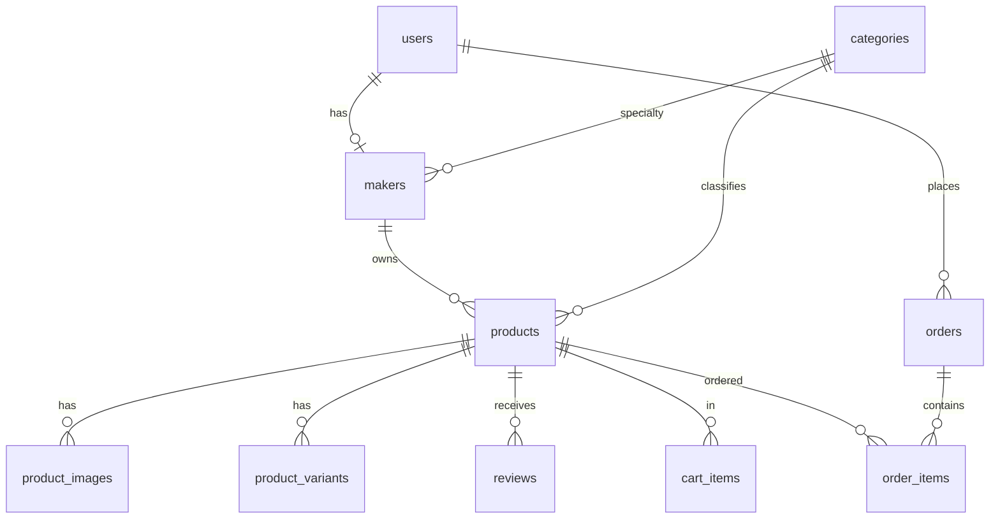

# 02 — Domain & Marketplace Model: VelCommerce

> Turunan dari 01-product-definition.md. Fokus: discovery domain, bukan migration final.

## 1. Aktor (3 Sisi)

```
Customer (Buyer)
  Discover → Explore → Product Detail → Cart → Checkout → Order → Review

Maker (Seller) — 1 User = 1 Store
  Register → Create Store (pending verification) → Add Product → Manage Inventory (small-batch) → Receive Order → Fulfill → Receive Review

Admin/Curator
  Review Maker → Moderate Product (is_curated) → Manage Categories → Monitor Orders → Handle Issues
```

Aturan portfolio: Maker adalah User dengan role `maker`, bukan entity terpisah tanpa User. Verifikasi adalah gate kurasi.

## 2. Domain Model Utama

```
User ──1──┬──0..1── Maker ──1──┬──0..*── Product ──*──1── Category (Craft)
          │                   │           ├───*── ProductImage
          │                   │           ├───*── ProductVariant (opsional, mis. glaze/color/size)
          │                   │           ├───*── Review
          │                   │           └───*── Wishlist / CartItem / OrderItem
          │                   │
          │                   └──0..*── Store (profile publik: Mawar Studio)
          │                             ├── location (city, province)
          │                             ├── craft_specialty (FK Category)
          │                             ├── story, studio_images
          │                             └── is_verified (kurasi)
          │
          ├──0..*── Address
          ├──0..*── Cart ──*── CartItem
          ├──0..*── Order ──*── OrderItem
          ├──0..*── Review
          └──0..*── Wishlist
```

**Inti yang membedakan dari e-commerce generik:**

| Konsep Generik | Konsep VelCommerce | Implementasi |
|----------------|--------------------|--------------|
| Product.stock: int | Product.availability + stock + production_time | `enum ready_stock, made_to_order, pre_order` |
| Product.category_id | Product.craft_id (FK categories) | 7 kategori kurasi |
| Product.description | Product.story + materials + craft_method + origin | Text + JSON |
| User = buyer | User hasOne Maker | `makers.user_id unique` |
| Admin CRUD produk | Admin kurasi `is_curated` & `is_verified` | Moderation queue |

## 3. Product — Detail Domain

```text
Product
├── maker_id (FK makers, NOT NULL) — setiap produk wajib punya maker
├── category_id (FK categories) — 1 craft utama (Ceramics, Textile, dst)
├── name, slug, description, short_description
├── price, compare_price (optional, untuk show value tanpa flash sale)
├── sku, barcode (optional)
├── materials: json | null — ["stoneware clay", "natural glaze"]
├── craft_method: string | null — "hand-thrown, kiln fired"
├── origin: string | null — "Kasongan, Bantul, Yogyakarta"
├── availability: enum('ready_stock','made_to_order','pre_order') default ready_stock
├── stock: int — hanya relevan jika ready_stock; jika made_to_order stock=0 valid
├── production_time: int | null — hari, mis. 14 untuk made_to_order
├── is_active, is_curated, is_featured
├── weight, dimensions (untuk shipping tetap butuh)
├── story: text | null — narasi editorial
├── process_steps: json | null — ["Clay", "Hand thrown", "Drying", "Glazing", "Kiln fired"]
├── meta_*
└── relations: maker, category, images, variants, reviews
```

**Aturan bisnis:**
- `ready_stock`: stock > 0, bisa checkout langsung.
- `made_to_order`: stock boleh 0, `production_time` wajib, checkout tetap bisa (pre-produce).
- `pre_order`: varian dari made_to_order dengan batch date (future: `available_at`).
- `compare_price` hanya untuk konteks, bukan untuk gimmick diskon 50%.

## 4. Maker / Store

```text
Maker (profile seller, 1 per User)
├── user_id (unique, FK users)
├── store_name: string — "Mawar Studio"
├── slug: unique — "mawar-studio"
├── craft_specialty: FK categories | null — specialty utama
├── location_city, location_province, location_full
├── story: text — narasi studio
├── avatar, cover_image
├── studio_images: json
├── is_verified: bool default false — gate kurasi Admin
├── verified_at
└── relations: user, products, specialtyCategory
```

Catatan: Untuk MVP, Maker dan Store digabung dalam satu table `makers`. Tidak perlu `stores` terpisah. Route publik: `/makers/{slug}`.

## 5. Category (Craft)

```text
Category
├── name: "Ceramics"
├── slug: "ceramics"
├── description, image
├── parent_id: null (flat untuk MVP, 7 kategori top-level)
├── is_active
└── products, makers (specialty)
```

Seed awal (7):
- ceramics, textile, woodcraft, jewelry, leather-goods, home-living, art

Hindari hierarki dalam (sub-sub kategori) di MVP. Portfolio lebih kuat dengan 7 yang solid.

## 6. Relasi Transaksional (tetap pakai existing)

Tetap pakai yang sudah ada, tidak perlu ubah banyak:
- `carts`, `cart_items` — persist DB, merge on login (sudah ada)
- `orders`, `order_items` — status `pending → paid → shipped → completed`
- `reviews` — 1 per user per product, hanya yang sudah beli (sudah ada, tambah relasi ke maker via product)
- `wishlists`, `coupons`, `addresses`

Tambahan kecil: `reviews` juga bisa menampilkan `maker_id` via product untuk agregasi rating Maker.

## 7. Apa yang TIDAK jadi Table di MVP

Sengaja tidak dibuat table terpisah agar tidak over-engineering:

- `materials` → json di product (bukan master table)
- `craft_methods` → string di product
- `collections` (curated sets) → bisa jadi `is_curated + is_featured` dulu, atau table `collections` di iterasi 2
- `process_steps` → json
- `store` terpisah → gabung ke makers

Domain discovery ≠ ERD final. Jika butuh filter by material di masa depan, baru extract jadi table.

## 8. Diagram Sederhana (Mermaid)



## 9. Implikasi ke UX

- Product Detail wajib load `maker` (eager) — bukan lazy.
- Maker Store page adalah listing `products where maker_id`.
- Filter utama: by Craft (category), by Availability, by Location (city).
- Search bukan hero, tapi tetap ada (by product name + maker name + material).

## 10. Next Step

Domain ini akan diterjemahkan ke:
- `03-user-goals.md` — goals per aktor
- `04-information-architecture.md` — struktur navigasi & URL
- Lalu `05-user-flows.md` — core loop Discover → Purchase

**Keputusan untuk di-lock:**
1. Maker = 1 User = 1 Store (gabung), bukan 2 table?
2. Availability enum 3 nilai cukup?
3. Materials & process_steps sebagai JSON dulu?

Jika setuju, kita kunci dan lanjut ke IA.
